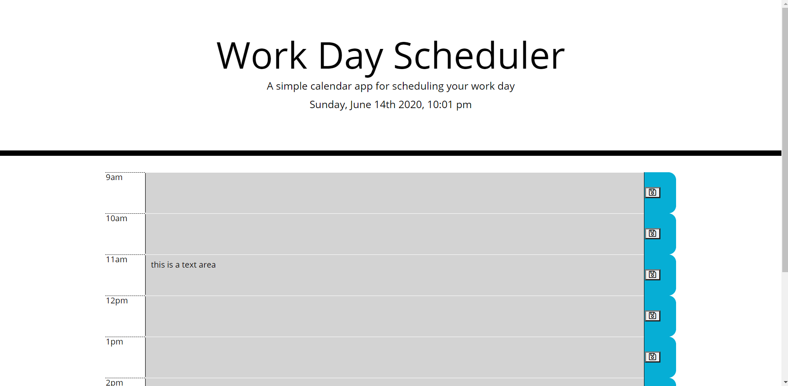

# week_planner

This is a web application that displays the hours of the work day and allows the user to add there tasks to each hour. The user then clicks a save button located on the right side of each hour block and the task is added to local storage and persists through page refreshes and opening and closing the browser , as long as local storage is not cleared.

### Prerequisites

The application is built using html, css and JavaScript. It utilizes Bootstrap , JQuery and the Moment.js library , all of which are added via cdn. there is nothing necessary for the user to install to begin using the application.

## License

This project is licensed under the MIT License - see the [LICENSE.md](LICENSE.md) file for details
